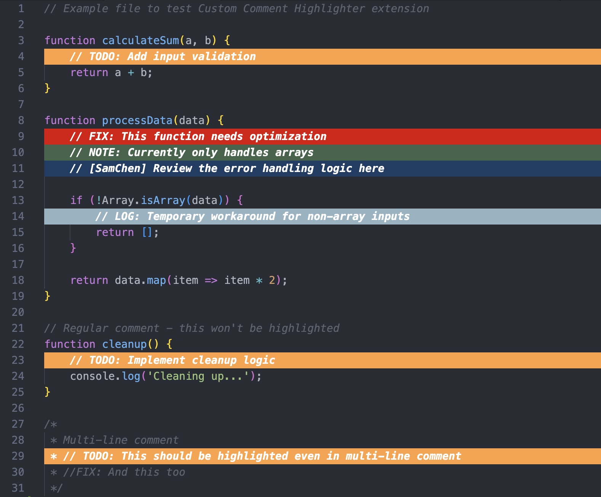

# Custom Comment Highlighter

A Visual Studio Code extension that highlights custom keywords in comments with configurable colors and bold formatting. Perfect for tracking TODOs, FIXMEs, personal tags, and other important markers in your code.



## Features

- **Customizable Keywords**: Define your own keywords to highlight (case-sensitive matching)
- **Vivid Background Colors**: Each keyword can have its own distinctive background color
- **Bold Text**: Highlighted lines are displayed in bold for better visibility
- **Toggle On/Off**: Quickly enable or disable highlighting with a command
- **Live Updates**: Highlights update automatically as you type
- **Configurable**: Easily add, edit, or remove keywords through VS Code settings

## Default Keywords

The extension comes pre-configured with these keywords (dark backgrounds with white text):

  - `// [SamChen]` - Dark Blue (#1A3D64)
  - `// TODO:` - Dark Teal (#FFA240)
  - `// FIX:` - Dark Red (#DC0000)
  - `// NOTE:` - Dark Green (#41644A)
  - `// LOG:` - Dark Gray (#94B4C1)

## Usage

### Basic Usage

1. Install the extension
2. Open any file in VS Code
3. Type one of the default keywords in a comment
4. The entire line will be highlighted with the configured color and bold font

Example:
```javascript
// TODO: Implement error handling
function processData() {
    //FIX: This needs optimization
    // NOTE: This is a temporary solution
    //[SamChen] Review this logic
}
```

### Toggle Highlighting

To turn highlighting on or off:

1. Open Command Palette (`Cmd+Shift+P` on Mac, `Ctrl+Shift+P` on Windows/Linux)
2. Type "Custom Comment Highlighter: Toggle Highlighting"
3. Press Enter

Or you can assign a keyboard shortcut for quick access.

### Customize Keywords and Colors

1. Open VS Code Settings (`Cmd+,` on Mac, `Ctrl+,` on Windows/Linux)
2. Search for "Custom Comment Highlighter"
3. Click "Edit in settings.json"
4. Modify the `customCommentHighlighter.keywords` array:

```json
{
  "customCommentHighlighter.keywords": [
    {
      "keyword": "//[YourName]",
      "color": "#8B2635"
    },
    {
      "keyword": "// IMPORTANT:",
      "color": "#8B0000"
    },
    {
      "keyword": "// REVIEW:",
      "color": "#4B0082"
    }
  ]
}
```

**Color Tips**: Use darker, dimmed colors for best readability with white text:
- Dark Red tones: `#8B2635`, `#8B0000`, `#800020`
- Dark Blue tones: `#1B5E63`, `#2C5F6F`, `#003366`
- Dark Yellow/Gold: `#8B6F00`, `#B8860B`, `#9B870C`
- Dark Purple: `#4B0082`, `#663399`, `#483D8B`
- Dark Green: `#2F4F2F`, `#0B6623`, `#355E3B`

## Installation

### Method 1: From VSIX File (Standalone Installation)

1. Download the `.vsix` file from the releases
2. Open VS Code
3. Go to Extensions view (`Cmd+Shift+X` or `Ctrl+Shift+X`)
4. Click the `...` menu at the top of the Extensions view
5. Select "Install from VSIX..."
6. Choose the downloaded `.vsix` file

### Method 2: From Source

1. Clone this repository
2. Open terminal in the project folder
3. Run: `npm install`
4. Run: `npm run package`
5. Install the generated `.vsix` file using Method 1

## Building a Standalone Package

To create a `.vsix` file for distribution:

1. Install vsce (if not already installed):
   ```bash
   npm install -g @vscode/vsce
   ```

2. In the project directory, run:
   ```bash
   vsce package
   ```

3. This will generate a file named `custom-comment-highlighter-0.0.1.vsix`

4. Share this file with others for easy installation

## Configuration

### Available Settings

- `customCommentHighlighter.enabled`: Enable or disable highlighting (default: `true`)
- `customCommentHighlighter.keywords`: Array of keyword configurations with colors

### Example Configuration

```json
{
  "customCommentHighlighter.enabled": true,
  "customCommentHighlighter.keywords": [
    {
      "keyword": "//[SamChen]",
      "color": "#8B2635"
    },
    {
      "keyword": "// TODO:",
      "color": "#1B5E63"
    },
    {
      "keyword": "//FIX:",
      "color": "#8B6F00"
    }
  ]
}
```

## Tips

1. **Case Sensitivity**: Keywords are case-sensitive. `// TODO:` and `// todo:` are different.
2. **Whole Line Highlighting**: The entire line containing the keyword will be highlighted with **white text on dark background**.
3. **Multiple Keywords**: You can have as many keywords as you need.
4. **Color Contrast**: Use darker background colors for best contrast with white text.
5. **Quick Toggle**: Set up a keyboard shortcut for the toggle command for faster access.

## Keyboard Shortcut Setup

To add a keyboard shortcut:

1. Open Keyboard Shortcuts (`Cmd+K Cmd+S` on Mac, `Ctrl+K Ctrl+S` on Windows/Linux)
2. Search for "Custom Comment Highlighter: Toggle"
3. Click the `+` icon and press your desired key combination
4. Example: `Cmd+Shift+H` or `Ctrl+Alt+H`

## Requirements

- Visual Studio Code v1.107.0 or higher

## Known Issues

None currently. Please report issues on the GitHub repository.

## Release Notes

### 0.0.1

Initial release:
- Customizable keyword highlighting
- Bold text formatting
- Configurable background colors
- Toggle command
- Live updates as you type

## License

This extension is provided as-is for personal and commercial use.

## Contributing

Feel free to submit issues and enhancement requests!

---

**Enjoy highlighting your comments!** 🎨

